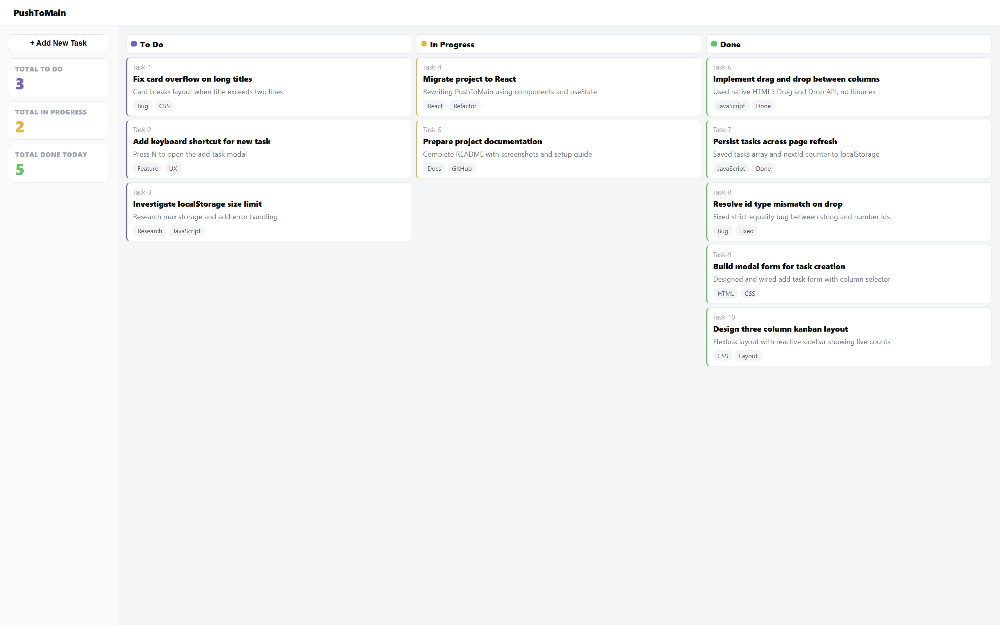
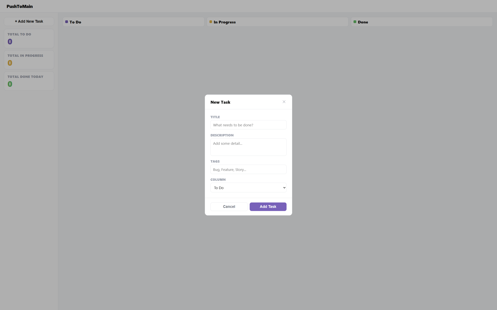
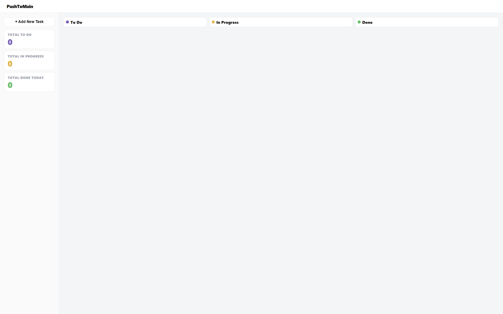
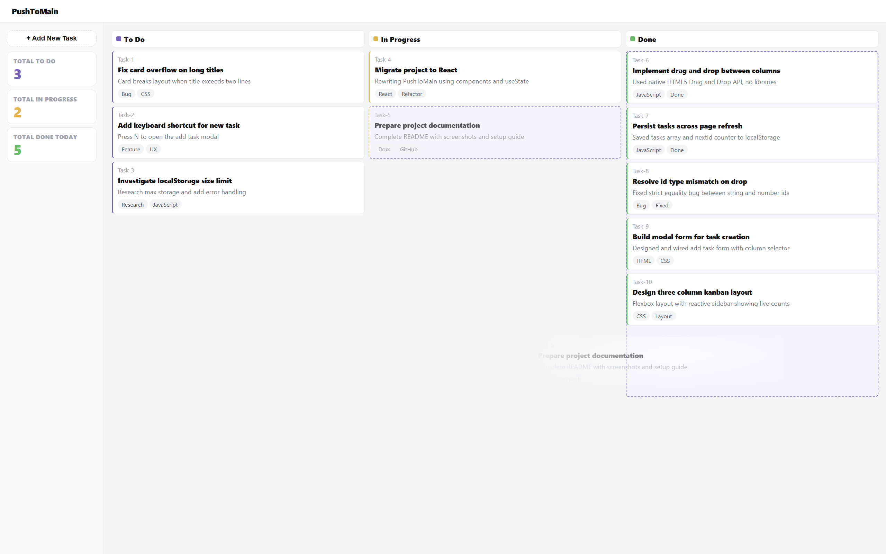

# PushToMain

> A developer-flavored Kanban board — built from scratch with vanilla HTML, CSS, and JavaScript. No frameworks. No libraries. Just the fundamentals.



---

## Features

- Add tasks with title, description, tags, and target column
- Drag and drop cards between columns with live visual feedback
- Sidebar counts update reactively as cards move
- Full localStorage persistence — nothing lost on refresh
- Clean modal form for task creation

---

## Screenshots

### Form For Adding New Task


### Empthy State


### Model With Tasks


### Drag and drop in action


---

## Stack

| Layer | Technology |
|-------|-----------|
| Structure | HTML5 |
| Styling | CSS3 — Flexbox, CSS custom properties |
| Logic | Vanilla JavaScript |
| State | In-memory array + localStorage |
| Drag & Drop | Native HTML5 Drag and Drop API |

---

## Project structure

```
PushToMain/
├── index.html
├── style.css
├── script.js
└── screenshots/
    ├── Home1.png
    ├── Home2.png
    ├── Home3.png
    └── Drag-Event.png
```

---

## Running locally

No build step, no installs.

```bash
# Option 1 — just open the file
open index.html

# Option 2 — VS Code Live Server
# Right click index.html → Open with Live Server
```
PARTH PUNGAONKAR
---

*Built as part of my fullstack learning path*
